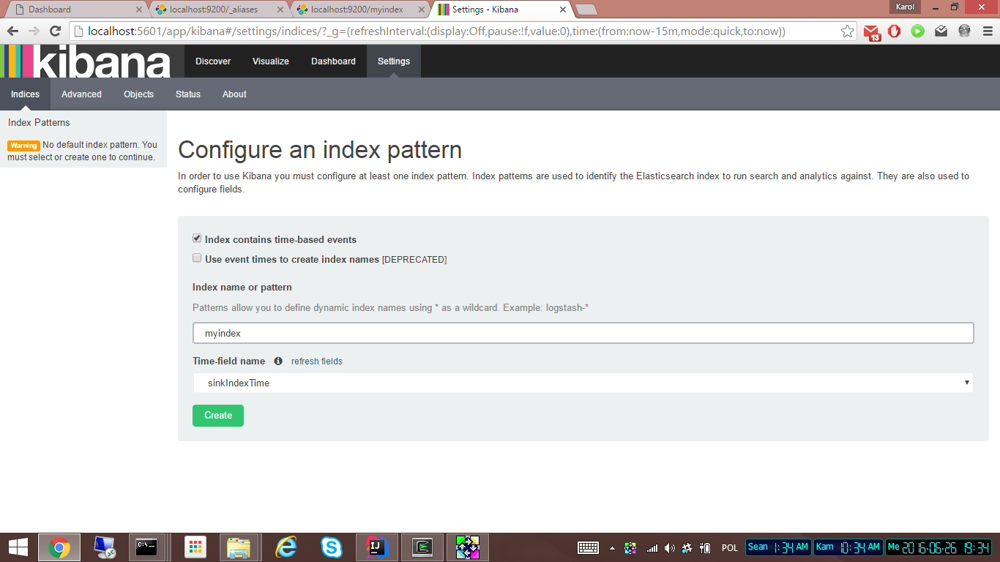

To be able to develop/debug this example you may want to install it's components locally.

# Elasticsearch

## Install
```
wget https://download.elastic.co/elasticsearch/release/org/elasticsearch/distribution/tar/elasticsearch/2.3.3/elasticsearch-2.3.3.tar.gz
```

tar -zxvf elasticsearch-2.3.3.tar.gz


## Configure
Elasticsearch allows for automatic node discovery and connecting to the cluster (see: https://www.elastic.co/guide/en/elasticsearch/reference/current/modules-discovery.htm).

Let's change `cluster.name` to make sure we don't accidentally connect to some other cluster (and vice versa).

Change `# cluster.name: my-application` in config/elasticsearch.yml to something unique, for example `gearpump-test`:

```
sed -i "" "s/# cluster.name: my-application/cluster.name: gearpump-test/g" elasticsearch-2.3.3/config/elasticsearch.yml
```

As we work on a single node here, include the following config fragment that changes default settings for index creation (no replicas, only one shard):

```
index.number_of_shards: 1
index.number_of_replicas: 0
```


## Run
elasticsearch-2.3.3/bin/elasticsearch


## Create index
Elasticsearch is able to create the index and type mapping automatically (https://www.elastic.co/guide/en/elasticsearch/reference/current/docs-index_.html#index-creation) while indexing.

I'd suggest we do this explicitly. The following requests can be used:

```
POST /myindex

PUT /myindex/_mapping/mytype
{
  "properties": {
    "word": {
      "type": "string",
      "fields": {
        "raw": {
          "type": "string",
          "index": "not_analyzed"
        }
      }
    },
    "count": {
      "type": "integer"
    },
    "sinkIndexTime": {
      "type": "date"
    }
  }
}
```

First request creates the index (`myindex`), second one sets proper mapping for `mytype`.

# Kibana

## Install

For Mac OS X:
```
wget https://download.elastic.co/kibana/kibana/kibana-4.5.1-darwin-x64.tar.gz
```

For linux:
```
wget https://download.elastic.co/kibana/kibana/kibana-4.5.1-linux-x64.tar.gz
```

Extract your archive 
Open config/kibana.yml in an editor 
Set the elasticsearch.url to point at your Elasticsearch instance
Run ./bin/kibana

tar -zxvf kibana-4.5.1-darwin-x64.tar.gz

kibana-4.5.1-darwin-x64/bin/kibana


## Configure index [TBD]




[[import objects]]

## Create visualizations [TBD]

