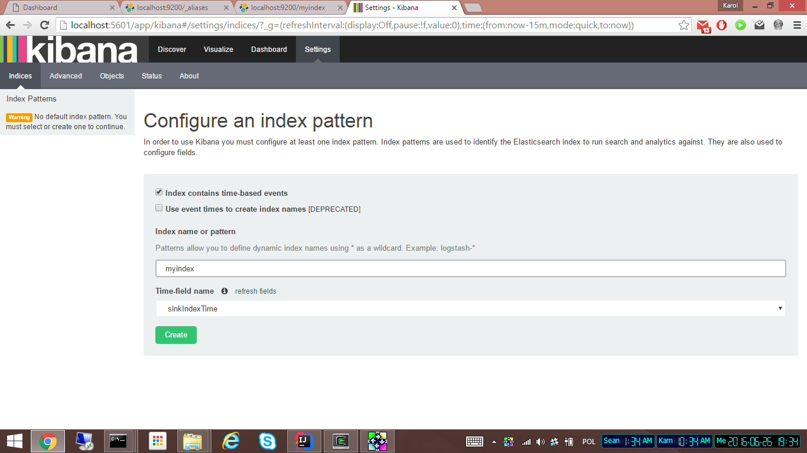

To be able to develop/debug this example you may want to install it's components locally.

# Elasticsearch

## Install
```
wget https://download.elastic.co/elasticsearch/release/org/elasticsearch/distribution/tar/elasticsearch/2.3.3/elasticsearch-2.3.3.tar.gz
```

tar -zxvf elasticsearch-2.3.3.tar.gz


## Configure

`# cluster.name: my-application`

sed -i "" "s/# cluster.name: my-application/cluster.name: gearpump-test/g" elasticsearch-2.3.3/config/elasticsearch.yml

## Run
elasticsearch-2.3.3/bin/elasticsearch


## Create index
Elasticsearch is able to create the index and type mapping automatically (https://www.elastic.co/guide/en/elasticsearch/reference/current/docs-index_.html#index-creation) while indexing.

I'd suggest we do this explicitly 


but to have better control 

# Kibana

## Install

For Mac OS X:
```
wget https://download.elastic.co/kibana/kibana/kibana-4.5.1-darwin-x64.tar.gz
```

For linux:
```
wget https://download.elastic.co/kibana/kibana/kibana-4.5.1-linux-x64.tar.gz
```

Extract your archive 
Open config/kibana.yml in an editor 
Set the elasticsearch.url to point at your Elasticsearch instance
Run ./bin/kibana

tar -zxvf kibana-4.5.1-darwin-x64.tar.gz

kibana-4.5.1-darwin-x64/bin/kibana


## Configure index [TBD]




[[import objects]]

## Create visualizations [TBD]

